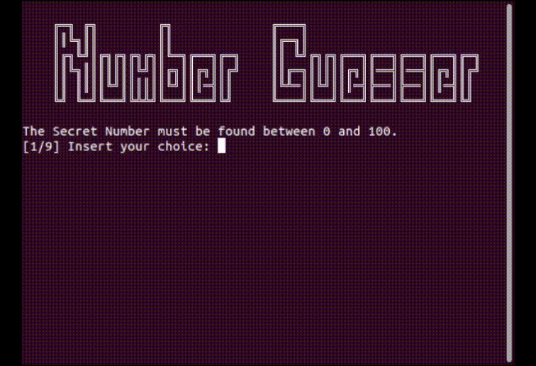
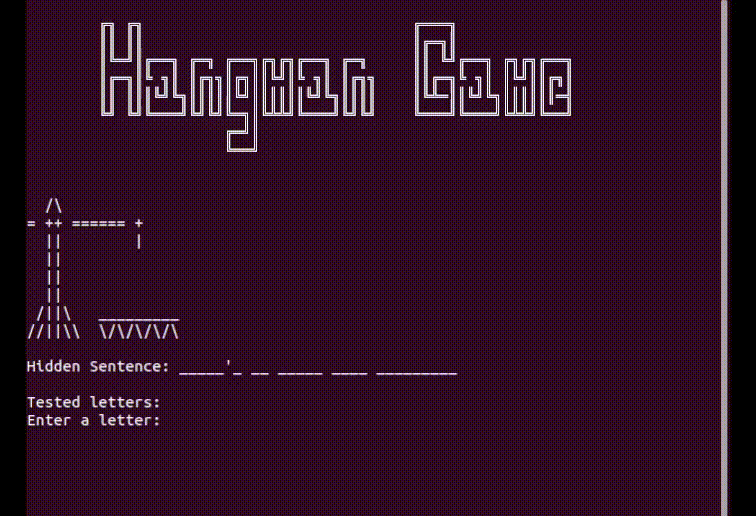
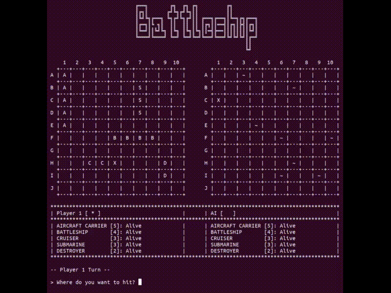

# Mini-Games-CPP
Mini-games written in C++.

## Terminal Style Demos
<table>
  <tr>
    <td style="border-color: black; background-color: black;">
      
    </td>
    <td style="border-color: black; background-color: black;">
      
    </td>
  </tr>

  <tr>
    <td style="border-color: black; background-color: black;">
      
    </td>
    <td style="border-color: black; background-color: black;">
       
    </td>
  </tr>
</table>
