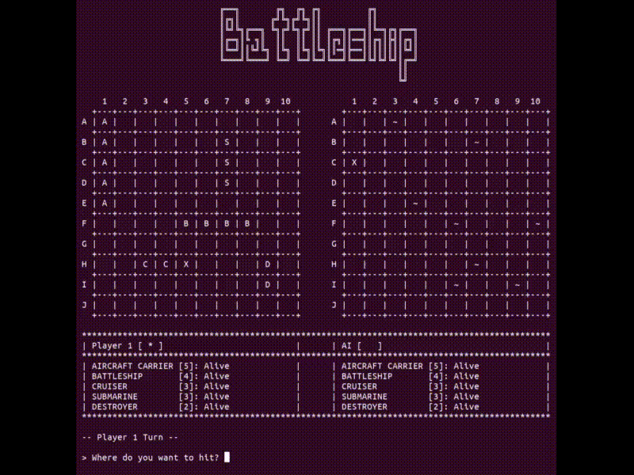

```
    ____        __  __  __          __    _     
   / __ )____ _/ /_/ /_/ /__  _____/ /_  (_)___ 
  / __  ` __ `/ __/ __/ / _ \/ ___/ __ \/ / __ \
 / /_/ / /_/ / /_/ /_/ /  __(__  ) / / / / /_/ /
/_____/\__,_/\__/\__/_/\___/____/_/ /_/_/ .___/ 
                                       /_/


~~~~~ ~~~~~~~~  ~~~~~~~~ ~~~~~~~  ~~~~~~~~~ ~~~~~ ~~~~~ ~ ~~~~~~~ ~~ ~ ~~~~~~~~ ~~~~~~  ~~~~~~ ~~~~ ~~~~~~ ~~~~~~ ~~~
 
 
                                 
                                 
                                                    |       o 
                                                    |          o 
                                              _ |__||         o o
                                             |       |          o o    
   |\               ______++_______++++______|       |___________o______
   | ) ______------/                                           o         \                                            
 S- + )                               <///////////>        (((= ~   ~~  ~  )   ~~    ~~    ~~~~   ~~   +====>
   | ) -------------____________________________________________________ /
   |/


```

## Rules
The game involves a single player (Player1) and the Computer (Player2).

The object of the game is to sink all enemy ships before your opponent.

The playing field consists of two grids, each 10x10 in size (letters are used to 
identify rows and numbers for columns).
Ships must be placed on the first playing field (first grid) vertically or 
horizontally, but not obliquely; also, ships cannot overlap.

Each ship has its own size that differentiates it from the others:
```
+ ------------------ + -------- +
| Ship Name          |  Length  |
+ ------------------ + -------- +
|  Aircraft Carrier  |    5     |
|  Battleship        |    4     |
|  Cruiser           |    3     |
|  Submarine         |    3     |
|  Destroyer         |    2     |
+ ------------------ + -------- +
```
Once the playing field has been set, each player will take turns making a move: 
he chooses the portion of the game to hit using the coordinates, trying to hit 
a portion of the ship.

During the game, the first grid takes into account Player2's progress in the 
match, while the second grid highlights how Player1 is doing.

If a ship is hit then an 'X' symbol will appear on the grid, otherwise 'O' is 
shown.

The game ends when all of one player's ships have been sunk (each has been hit 
along its entire length).

## Gameplay Demo

